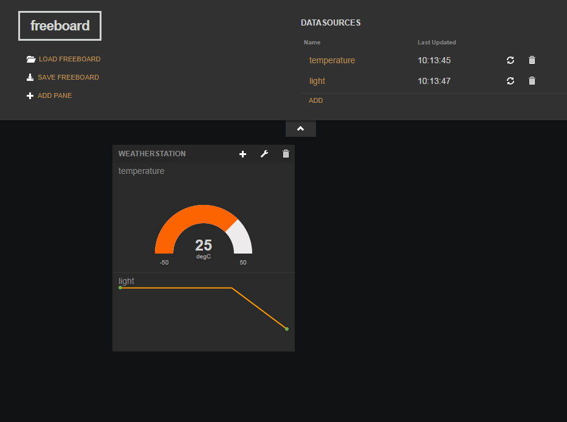

Weather Station Arduino
==================

This weather station is composed of:

- An Arduino board, where sensors (temperature, light) are connected. This node will run C code.
- A Gateway (a PC, Raspberry Pi or similar) with IP connectivity where the Arduino is connected (currently via a serial/USB link). This node will run Java code. In this demo, we will use a standard PC.
- A web server (a PC, cloud server or similar) where data coming from the gateway will be pushed. In this demo, we will use the same PC.

The behavior of the weather station is fairly simple: it samples and format temperature and light data a send them to the gateway, when (either):
- every 30 seconds, the Arduino will systematically send the data (light, then after 30 seconds temperature, etc)
- when a button is pushed on the Arduino board, it will force a data to be sent to the gateway (first push, light is sent, second push temperature is sent, etc)
- when a virtual button (a Java Swing widget) is pushed on the gateway, it will also force a data to be sent
- when the Gateway receives a proper HTTP request, it will force the Arduino to send a data
- when the Gateway receives a proper WebSocket request, it will also force the Arduino to send a data

Any data received by the Gateway from the Arduino will be pushed on a HTTP server, so that any client can access these data. For example, the data of the Weather station can be visualized using [Freeboard](http://freeboard.io/)

